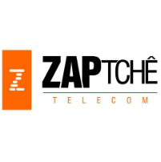
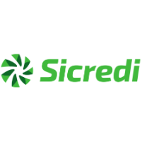

## Sobre

O grupo de usuários de Software Livre Tchelinux, em parceria com a [**Universidade Federal do Pampa Campus Bagé**](http://novoportal.unipampa.edu.br/bage/), tem o prazer de convidar a comunidade para participar do evento que ocorrerá no dia **05 de Outubro de 2019 a partir das 8:30h** na UNIPAMPA em Bagé.

## Inscrições

As inscrições estarão abertas a partir do dia 5 de Setembro, quando a **programação do evento** for anunciada.

O evento tem **entrada franca**, porém os participantes são encorajados a doar 2kg de alimentos não perecíveis (exceto sal), que são doados a instituições de caridade da região.

Os alimentos são recebidos no momento do credenciamento.

<a href="https://bage.tchelinux.org/inscricoes/" style="color:#ff4040"><b><h3>Clique aqui e faça sua inscrição!<h3></b></a>

## Certificados

Serão fornecidos certificados digitais para os participantes do evento, que confirmaram sua presença. Para obtê-los, você deverá utilizar o email fornecido na sua inscrição para o evento.

**Importante:** Não esqueça de confirmar sua presença no credenciamento.

## Programação

| 
 Horário 
 | 
 Sala Ípsillon 
 | 
 Sala Personal Care 
 | 
 Sala Universo de Bolso 
 |
|:--------------------------:|:-----------------------:|:-----------------------:|:-----------------------:|
| **08:30** <td colspan=4>
**Credenciamento**   Espaço Café da Bento   
 |
| **09:00** <td colspan=4>
**Abertura**  Espaço Zap Tchê   Todo o público  Equipe Tchelinux  
 |
| **09:20** <td colspan=4>
[**Porque e Como Participar de Projetos Open Source**](#Porque_e_Como_Participar_de_Projetos_Open_Source)   Espaço Zap Tchê   Principiante   Julio Biason |
| **10:10** <td colspan=4>
[**Empreendendo e gerando oportunidades na região da Campanha com Software Livre**](#Empreendendo_e_gerando_oportunidades_na_região_da_Campanha_com_Software_Livre)   Espaço Zap Tchê   Principiante   Everton Catto Heckler, Fabrizio Mello |
| **11:10** | [**Golang: a linguagem de programação mais esperada do ano**](#Golang:_a_linguagem_de_programação_mais_esperada_do_ano)   Principiante   Ricardo Robaina | [**Web Scraping: a arte de automatizar a recuperação de informação na Web**](#Web_Scraping:_a_arte_de_automatizar_a_recuperação_de_informação_na_Web)   Principiante   Alex Dias Camargo | [**Desenvolvendo Redes Neurais Articiais com WEKA e R**](#Desenvolvendo_Redes_Neurais_Articiais_com_WEKA_e_R)   Intermediário   Rodrigo Silva |
| **12:00** <td colspan=4>
**Intervalo para Almoço**
 |
| **13:30** | [**Porque Você Deve Aprender Rust**](#Porque_Você_Deve_Aprender_Rust)   Principiante   Julio Biason | [**Faça coisas fantásticas com PHP!**](#Faça_coisas_fantásticas_com_PHP!)   Intermediário   Everton Catto Hecker |  [**Introdução a React Native com Expo**](#Introdução_a_React_Native_com_Expo)  Principiante   Welbert Hime |
| **14:20** | [**Desenvolvendo Jogos com Python e Pygame**](#Desenvolvendo_Jogos_com_Python_e_Pygame) Principiante   Rafael Jeffman | [**Introdução ao desenvolvimento Android com Kotlin**](#Introdução_ao_desenvolvimento_Android_com_Kotlin) Principiante   Ricardo Robaina |[**Git em projetos acadêmicos**](#Git_em_projetos_acadêmicos)   Principiante   Sandro Custódio |
| **15:10** <td colspan=4>
**Coffee-Break**
 |
| **15:40** | [**Dados no espaço-tempo: Trabalhando com Dados Georreferenciados no MongoDB**](#Dados_no_espaço-tempo:_Trabalhando_com_Dados_Georreferenciados_no_MongoDB)   Principiante   Ricardo Robaina | [**Introdução ao Desenvolvimento Móvel com Ionic**](#Introdução_ao_Desenvolvimento_Móvel_com_Ionic)   Principiante   Rafael Jeffman | [**Mecanismos anti-exploit nativos em distribuições Linux da atualidade**](#Mecanismos_anti-exploit_nativos_em_distribuições_Linux_da_atualidade)   Intermediário   Roner Rodriguez |
| **16:30** | [**Como entregar aplicações Java com mais eficiência usando Quarkus**](#Como_entregar_aplicações_Java_com_mais_eficiência_usando_Quarkus)   Intermediário   Rodrigo Freitas | [**PHP e PostgreSQL: Dois elefantes ajudando no seu projeto!**](#PHP_e_PostgreSQL:_Dois_elefantes_ajudando_no_seu_projeto!)   Principiante   Everton Catto Heckler | [**Ferramentas open source e colaborativas para validação de notícias online**](#Ferramentas_open_source_e colaborativas_para_validação_de_notícias_online)   Principiante   Equipe Unihacker |
| **17:20** <td colspan=4>
**Encerramento**  Espaço Zap Tchê   Todo o público     Equipe Tchelinux    
 |

## Palestras

### Porque e Como Participar de Projetos Open Source

No mundo atual, todos usam pelo menos um aplicativo open source. Mas como participar disso? Como ajudar o aplicativo a melhorar? É preciso saber programar para ajudar? Essas e outras perguntas serão respondidas nessa apresentação.

### Julio Biason

[**Julio Biason**](https://functional.cafe/@juliobiason) participa de projetos open source desde 1990.

### Empreendendo e gerando oportunidades na região da Campanha com Software Livre

Um bate papo contando sobre como o Empreendedorismo e o Software Livre podem ajudar a gerar oportunidades e reter talentos na região da Campanha.

### Everton Catto Heckler

[**Everton Catto Heckler**](https://www.linkedin.com/in/everton-heckler/) é CEO da Catto Tecnologia Aplicada. Graduado na Urcamp, é desenvolvedor de software a muito tempo.

### Golang: a sua próxima linguagem de programação favorita

A linguagem Golang (ou simplesmente "Go") foi anunciada no ano de 2009 e dês de então vem sendo venerada por seu usuários (também conhecido como "Gophers"). Segundo dados do Hacker Rank, Go é a linguagem que a maioria dos programadores deseja aprender em 2019. Embarque conosco nessa "Go Tour" e conheça um pouco sobre a sua próxima linguagem de programação favorita!

### Ricardo Robaina

[**Ricardo Robaina**](https://github.com/robainaricardo) é bacharel em Engenharia de Computação pela Universidade Federal do Pampa, foi honrado com o prêmio SBC como aluno destaque de sua turma. Apaixonado por computação e por Software Livre, possui experiência com desenvolvimento de simuladores, jogos sérios, classificadores e aplicações móveis, além de trabalhos relacionados ao desenvolvimento de aceleradores de hardware e co-design. Atualmente é mestrando no Programa de Pós-Graduação em Computação Aplicada (PPGCAP) da UNIPAMPA e voluntário do Tchelinux.

### Web Scraping: a arte de automatizar a recuperação de informação na Web

As páginas Web tradicionais são construídas utilizando linguagens de marcação baseadas em textos (HTML ou XHTML), e frequentemente contêm uma riqueza de dados textuais úteis. Devido a isso, diferentes tecnologias foram criadas e que "raspam" conteúdos da Web. Um Web Scraping é uma implementação para extrair dados de um web site. O conteúdo pode ser usado para replicar em algum outro site ou para análise de dados. Nesta palestra você aprenderá a utilizar o Python para realizar Web scraping a fim de submeter e coletar informações de sites.

### Alex Dias Camargo

[**Alex Dias Camargo**](https://facebook.com/alexcamargoweb) é Bacharel em Sistemas de Informação pela URCAMP (2010), Especialista em Sistemas Distribuídos com Ênfase em Banco de Dados pela UNIPAMPA (2013) e Mestre em Engenharia de Computação pela FURG (2017). Atualmente é Doutorando em Ciência da Computação pela UFPEL, na modalidade aluno especial. Também é colaborador nos projetos de pesquisa Algo+: um portal para o apoio ao ensino de Algoritmos; Bioinformática Estrutural de Proteínas: modelos, algoritmos e aplicações biotecnológicas; bem como, UniHacker.Club: Clube Universidade Hacker. Além disso, é professor no Instituto Federal Sul-rio-grandense - Câmpus Bagé e revisor dos periódicos ICCEEg (ISSN 2236-0093) e CCEI (ISSN 2356-6635). Possui interesse nas áreas de programação para a web e dispositivos móveis, programação paralela, bancos de dados distribuídos, aprendizado de máquina, bioinformática estrutural, bases de dados biológicas e sistemas operacionais Linux (Ubuntu e Mint). Por fim, é entusiasta da Cosmologia, Astronomia e Astrofísica.

### Desenvolvendo Redes Neurais Articiais com WEKA e R

Nas redes neurais artificiais, a ideia é realizar o processamento de informações tendo como princípio a organização de neurônios do cérebro. Como o cérebro humano é capaz de aprender e tomar decisões baseadas na aprendizagem, as redes neurais artificiais devem fazer o mesmo, assim, uma rede neural pode ser interpretada como um esquema de processamento capaz de armazenar conhecimento baseado em aprendizagem (experiência) e disponibilizar este conhecimento para a aplicação em questão. A palestra visa demonstrar à prática sobre o funcionamento de uma rede neural multilayer perceptron, entendendo todas as etapas do processo, como o cálculo dos pesos,  taxa de aprendizagem, descida do gradiente e erros, utilizando-se dos softwares WEKA e R.

### Rodrigo Silva

Rodrigo Silva possui graduação em Matemática (Licenciatura Plena) pela Universidade da Região da Campanha (URCAMP) em 2009 e Tecnologia em Análise e Desenvolvimento de Sistemas pelo Instituto Federal de Educação, Ciência e Tecnologia Sul-riograndense (IFSul) em 2018. Especialista em Metodologia do Ensino de Matemática e Física pela Faculdade Internacional de Curitiba (UNINTER) concluído em 2012. Atuou no GSI - Grupo de Estudos em Segurança de Sistemas e da Informação na Universidade Federal do Pampa (UNIPAMPA) e também desenvolveu atividades de pesquisa junto à EMBRAPA Pecuária Sul. É colaborador oficial do projeto Portugol Studio, na produção de materiais de ensino. Atualmente é aluno nos cursos de Especialização em Desenvolvimento Orientado a Objetos em JAVA pela UNICIV. Tem interesse na área de aprendizagem de máquina, mineração de dados, redes neurais artificiais, algoritmos genéticos, ensino de programação, desenvolvimento android, API(REST/RESTFull). Trabalha na Prefeitura Municipal de Bagé, no setor de GeoInformação com informações geográficas e desenvolvimento de sistemas WEB e mobile.

### Porque Você Deve Aprender Rust

Rust (a linguagem, não o jogo) é uma linguagem que produz código em que a memória é protegida. Trazendo muitas das funcionalidades de linguagens funcionais, com abstrações de alto nível e performance semelhante a C, Rust é uma linguagem que você realmente deve aprender.

### Julio Biason

[**Julio Biason**](https://functional.cafe/@juliobiason) é programador desde os 12 anos e já conheceu várias linguagens, mas nenhuma que fosse tão interessante quanto Rust.

### Faça coisas fantásticas com PHP!

Pretendo apresentar algumas boas práticas para para desenvolvimento. Também pretendo mostrar algumas ferramentas que ajudam o nosso dia a dia.

### Everton Catto Heckler

[**Everton Catto Heckler**](https://www.linkedin.com/in/everton-heckler/) é CEO da Catto Tecnologia Aplicada. Graduado na Urcamp, é desenvolvedor de software a muito tempo.

### Introdução a React Native com Expo

Se você é um novato em desenvolvimento mobile, um dos caminhos mais simples a seguir é com o Expo. Expo é um conjunto de ferramentas e serviços para build, deploy e rápida interação entre aplicativos iOS, Android e web utilizando o mesmo código fonte. Com Expo você pode desenvolver seu aplicativo React Native em alguns instantes, necessitando somente do Node.js instalado e um celular ou emulador e, assim, a única alteração em código que você faz é em JavaScript.

### Welbert Hime

[**Welbert Hime**](https://github.com/himewel) é Diretor Presidente da Pampec Jr, estagiário na Justiça Militar e as vezes percussionista em banda de concerto. Formado em Técnico de Redes de Computadores na ETEC (2015) e graduando no curso de Engenharia de Computação na Unipampa - Campus Bagé (desde 2016). Atualmente estuda desenvolvimento de arquiteturas de hardware para algoritmos de Deep Learning, porém tem interesse também em desenvolvimento Web, Mobile e Software Livre.

### Desenvolvendo Jogos com Python e Pygame

Jogar todo mundo joga. Programar, todo mundo pode. Jogar todo mundo treina. Programar, nem tanto. Mas para jogar é necessário que alguém desenvolva suas habilidades de programador. Nesse bate papo, porque ninguém mais tem paciência para palestras, será apresentada uma forma divertida de desenvolver a programação e conhecer a linguagem Python, construindo jogos, utilizando a biblioteca Pygame e ferramentas open source para desenvolver um jogo.

### Rafael Jeffman

[**Rafael Jeffman**](https://github.com/rafasgj) é Rafael Jeffman é desenvolvedor de software, fotógrafo, impressor e professor universitário. Leciona de desenvolvimento de software, estruturas de dados e design de jogos. Colaborou por anos com a distribuição GoboLinux, e hoje trabalha na Red hat. Entre seus projetos atuais encontram-se, um sistema de gerenciamento de ativos digitais multiplataforma, open source, uma linguagem de domínio para o ensino de design de jogos, e um sistema de dataflow para o processamento multimidia.

### Introdução a React Native com Expo

Atualmente, cerca de 88% dos dispositivos móveis utilizam o sistema operacional Android. No Google I/O de 2017, a linguagem de programação Kotlin foi incluída como uma linguagem com suporte oficial para o desenvolvimento desta plataforma. Essa palestra tem como objetivo introduzir o processo de desenvolvimento de aplicativos Android, utilizando a linguagem de programação Kotlin.

### Ricardo Robaina

[**Ricardo Robaina**](https://github.com/robainaricardo) é bacharel em Engenharia de Computação pela Universidade Federal do Pampa, foi honrado com o prêmio SBC como aluno destaque de sua turma. Apaixonado por computação e por Software Livre, possui experiência com desenvolvimento de simuladores, jogos sérios, classificadores e aplicações móveis, além de trabalhos relacionados ao desenvolvimento de aceleradores de hardware e co-design. Atualmente é mestrando no Programa de Pós-Graduação em Computação Aplicada (PPGCAP) da UNIPAMPA e voluntário do Tchelinux.

### Git em projetos acadêmicos

Git em projetos acadêmicos, como num TCC onde um pequeno grupo desenvolve em conjunto. O Git é "a ferramenta" de versionamento e software criada por Linus Torvalds e que dominou o mercado atual. É não apenas gratuíta, é mais que isso, é um Software Livre, de ampla utilização e altamente reconhecido. Até os serviços web que suportam o Git são bons e gratuitos nestes casos.

### Sandro Custódio

[**Sandro Custódio**](https://www.linkedin.com/in/sandro-custodio/) é Servidor Público da Justiça Federal com mais de 20 anos de TI, foco no Suporte a usuários, pitadas de infra e mais recentemente retornando ao desenvolvimento. Seu primeiro contato com Linux foi em 2003, e desde 2012 usa apenas Linux em casa. Já administrou UNIX e nos dias de hoje utiliza Ubuntu, Mint e CentOS. Tem como hobbies: Moto, Viagens, Fotografia e Astronomia.

### Dados no espaço-tempo: Trabalhando com Dados Georreferenciados no MongoDB

Algumas coisas mudam de lugar no espaço, outras apenas mudam com o passar do tempo. Já a maioria das coisas estão sempre mudando tanto em relação ao espaço quanto ao tempo. Hoje em dia, é possível identificar um lugar no espaço facilmente, devido à disponibilidade de sistemas de localização, como o GPS, em dispositivos móveis. Aplicações baseadas em localização são cada vez mais comuns e apresentam-se com diferentes objetivos: coletar dados de trajetória durante uma atividade física, encontrar o meio de transporte ou o amor mais próximo ou até mapear a variabilidade espacial em sistemas de agricultura de precisão. O banco de dados MongoDB possui suporte a dados e a operações georreferenciadas. O objetivo dessa palestra é apresentar as principais funcionalidades do MongoDB com potencial utilização em aplicações baseadas em localização.

### Ricardo Robaina

[**Ricardo Robaina**](https://github.com/robainaricardo) é bacharel em Engenharia de Computação pela Universidade Federal do Pampa, foi honrado com o prêmio SBC como aluno destaque de sua turma. Apaixonado por computação e por Software Livre, possui experiência com desenvolvimento de simuladores, jogos sérios, classificadores e aplicações móveis, além de trabalhos relacionados ao desenvolvimento de aceleradores de hardware e co-design. Atualmente é mestrando no Programa de Pós-Graduação em Computação Aplicada (PPGCAP) da UNIPAMPA e voluntário do Tchelinux.

### Introdução ao Desenvolvimento Móvel com Ionic

Existem duas formas de desenvolver aplicações para dispositivos móveis, utilizando ferramentas nativas, ou utilizando ferramentas híbridas, e cada uma apresenta suas vantagens e desvantagens. Ionic é uma ferramenta híbrida para desenvolvimento de aplicações multi-plataforma, que permite o uso de componentes nativos, mantendo, ainda assim, uma base de código comum. Nessa palestra desenvolveremos uma pequena aplicação para consulta a serviços disponibilizados na web, examinando cada passo do desenvolvimento.

### Rafael Jeffman

[**Rafael Jeffman**](https://github.com/rafasgj) é Rafael Jeffman é desenvolvedor de software fotógrafo, impressor e professor universitário. Leciona de desenvolvimento de software, estruturas de dados e design de jogos. Colaborou por anos com a distribuição GoboLinux e hoje trabalha na Red Hat. Entre seus projetos atuais encontram-se, um sistema de gerenciamento de ativos digitais multiplataforma, open source, uma linguagem de domínio para o ensino de design de jogos, e um sistema de dataflow para o processamento multimidia.

### Ricardo Robaina

[**Ricardo Robaina**](https://github.com/robainaricardo) é bacharel em Engenharia de Computação pela Universidade Federal do Pampa, foi honrado com o prêmio SBC como aluno destaque de sua turma. Apaixonado por computação e por Software Livre, possui experiência com desenvolvimento de simuladores, jogos sérios, classificadores e aplicações móveis, além de trabalhos relacionados ao desenvolvimento de aceleradores de hardware e co-design. Atualmente é mestrando no Programa de Pós-Graduação em Computação Aplicada (PPGCAP) da UNIPAMPA e voluntário do Tchelinux.

### Mecanismos anti-exploit nativos em distribuições Linux da atualidade

O objetivo é apresentar um resumo dos mecanismos anti-exploit disponíveis na maioria das distros Linux modernas, além de justificar sua necessidade e apresentar detalhamento sobre a implementação de alguns destes, bem como seus bypass já divulgados.

### Roner Rodriguez

[**Roner Rodriguez**](https://github.com/Ansatsuken1337x/) é Graduando no curso de Engenharia de Computação na Unipampa Campus Bagé e trabalha atualmente como desenvolvedor Delphi com SQL.

### Como entregar aplicações Java com mais eficiência usando Quarkus

Quarkus é um framework desenvolvido pela RedHat, personalizado para GraalVM e OpenJDK utilizando o HotSpot como Java Virtual Machine (JVM), sendo possível usar as versões 8 e 11 do OpenJDK (respectivamente 8u222-b10 e 11.0.4+11). Com ele podemos usar Java e/ou Kotlin como linguagem de programação para desenvolvermos nossas aplicações.

Quarkus veio para despedaçar o paradigma de que java é lento, pesado e que não atende às exigências de arquiteturas de desenvolvimento de aplicações atuais. Utilizando a técnica de compilação Ahead-of-time compilation (AOT compilation) que em conjunto com a GraalVM produzem um código otimizado para a máquina ou seja utilizando instruções nativas do Sistema Operacional (SO), assim como os compiladores convencionais que normalmente já conhecemos. Porém a diferença está em como ele faz isso, basicamente transformando bytecode da máquina virtual (VM) em código de máquina. Isso se difere do que a JVM faz, que é executar o bytecode Java e compilar o código freqüentemente executado para o código nativo, usando a técnica de compilação Just-in-Time (JIT) que por sua vez utiliza heurísticas para saber quando fazer isso. Quarkus é incrivelmente rápido em tempo de inicialização, além de utilizar pouca memoria, o que alavanca a adoção dele para aplicações claud-native ou seja nativo para nuvem.

A talk contempla a explicação sobre Quarkus, suas extensões, uma breve explicação sobre JVM, GraalVM e um live code para construirmos uma PoC demonstrando como usar o Quarkus.

### Rodrigo Freitas

[**Rodrigo Freitas**](https://www.linkedin.com/in/rodrigo-freitas-26b973101/) é Back-end developer na DB1 Global Software, completamente apaixonado por tecnologia, gestão ágil, desenvolvimento de software, desenvolvimento pessoal, cultura geek e chimarrão. Trabalha com Java e web a aproximadamente 6 anos, faz parte do time de coordenadores do Grupo de Usuários Java do Rio Grande do Sul (RSJUG), é graduado em Análise e Desenvolvimento de Sistemas pelo IFSul Campus Bagé onde hoje faz parte do corpo docente como professor substituto. Tem se dedicado a evangelizar sobre trabalho e cultura remota.

### PHP e PostgreSQL: Dois elefantes ajudando no seu projeto!

Dependendo do sistema onde vamos aplicar está técnica de Full-text search usamos ferramentas como Elasticsearch, Apache Solr, Lucene. Com está palestra pretendo mostrar uma alternativa simples para aqueles sistemas pequenos onde ainda não precisamos aplicar um esforço/Custo ao projeto, pretendo utilizar uma abordagem mostrando como se é feito "no braço" e depois a formar mais simples. utilizaremos nesta palestra PHP, PostgreSQL, Framework Laravel.

### Everton Catto Heckeler

[**Everton Catto Heckler**](https://www.linkedin.com/in/everton-heckler/) é CEO da Catto Tecnologia Aplicada. Graduado na Urcamp, é desenvolvedor de software a muito tempo.

### Ferramentas open source e colaborativas para validação de notícias online

Nós somos do projeto Unihacker e temos como desafio a validação de informações e notícias online. Iremos apresentar o projeto, nossas motivações e algumas ferramentas open source e colaborativas que ajudam na validação de informações e notícias no meio digital.

### Equipe Unihacker

Graduandos em Engenharia de Computação da UNIPAMPA e membros do projeto Unihacker.

## Local

> **Universidade Federal do Pampa**
> Av. Maria Anunciação Gomes Godoy, 1650
> Bagé, RS

    <iframe src="https://www.google.com/maps/embed?pb=!1m14!1m8!1m3!1d16213.017252856944!2d-54.11138967634479!3d-31.32123556842213!3m2!1i1024!2i768!4f13.1!3m3!1m2!1s0x0%3A0xc1051c6b4afaa779!2sUniversidade+Federal+do+Pampa!5e0!3m2!1spt-BR!2sbr!4v1563079075488!5m2!1spt-BR!2sbr" width="600" height="480" frameborder="0" style="border:0" allowfullscreen></iframe>

## Apoio

### Institucional

### Patrocínio

### Divulgação

