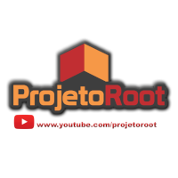

## Sobre

O grupo de usuários de Software Livre Tchelinux, em parceria com a [**Universidade Federal do Pampa Campus Bagé**](http://novoportal.unipampa.edu.br/bage/), tem o prazer de convidar a comunidade para participar do evento que ocorrerá no dia **05 de Outubro de 2019 a partir das 8:30h** na UNIPAMPA em Bagé.

## Inscrições

As inscrições estarão abertas a partir do dia 26 de Agosto, quando a **programação do evento** for anunciada.

O evento tem **entrada franca**, porém os participantes são encorajados a doar 2kg de alimentos não perecíveis (exceto sal), que são doados a instituições de caridade da região.

Os alimentos são recebidos no momento do credenciamento.

## Certificados

Serão fornecidos certificados digitais para os participantes do evento, que confirmaram sua presença. Para obtê-los, você deverá utilizar o email fornecido na sua inscrição para o evento.

**Importante:** Não esqueça de confirmar sua presença no credenciamento.

## Programação

| 
 Horário 
 | 
 Sala 1 
 | 
 Sala 2 
 | 
 Sala 3 
 |
|:--------------------------:|:-----------------------:|:-----------------------:|:-----------------------:|
| **08:30** <td colspan=4>
**Credenciamento**
 |
| **09:00** <td colspan=4>
**Abertura**  Auditório   Todo o público  Equipe Tchelinux  
 |
| **09:20** <td colspan=4>
[**Porque e Como Participar de Projetos Open Source**](#Porque_e_Como_Participar_de_Projetos_Open_Source)   Auditório   Principiante   Julio Biason |
| **10:10** <td colspan=4>
[**Empreendendo e gerando oportunidades na região da Campanha com Software Livre**](#Empreendendo_e_gerando_oportunidades_na_região_da_Campanha_com_Software_Livre)   Auditório   Principiante   Everton Catto Heckler, Fabrizio Mello |
| **11:10** | [**Golang: a linguagem de programação mais esperada do ano**](#Golang:_a_linguagem_de_programação_mais_esperada_do_ano)   Principiante   Ricardo Robaina | [**Web Scraping: a arte de automatizar a recuperação de informação na Web**](#Web_Scraping:_a_arte_de_automatizar_a_recuperação_de_informação_na_Web)   Principiante   Alex Dias Camargo | [**AION Ferramenta de Gestão de Tarefas: Da planilha ao Software Livre**](#AION_Ferramenta_de_Gestão_de_Tarefas:_Da_planilha_ao_Software_Livre)   Principiante   Fernando Fagonde |
| **12:00** <td colspan=4>
**Intervalo para Almoço**
 |
| **13:30** | [**Porque Você Deve Aprender Rust**](#Porque_Você_Deve_Aprender_Rust)   Principiante   Julio Biason | [**Faça coisas fantásticas com PHP!**](#Faça_coisas_fantásticas_com_PHP!)   Intermediário   Everton Catto Hecker | [**Criação de uma Startup de Transformação Digital: Os desafios do modelo de negócio ao produto**](#Criação_de_uma_Startup_de_Transformação_Digital:_Os_desafios_do_modelo_de_negócio_ao_produto)   Principiante   Fernando Fagonde |
| **14:20** | [**Desenvolvendo Jogos com Python e Pygame**](#Desenvolvendo_Jogos_com_Python_e_Pygame) Principiante   Rafael Jeffman | [**Introdução ao desenvolvimento Android com Kotlin**](#Introdução_ao_desenvolvimento_Android_com_Kotlin) Principiante   Ricardo Robaina |[**Git em projetos acadêmicos**](#Git_em_projetos_acadêmicos)   Principiante   Sandro Custódio |
| **15:10** <td colspan=4>
**Coffee-Break**
 |
| **15:40** | [**Dados no espaço-tempo: Trabalhando com Dados Georreferenciados no MongoDB**](#Dados_no_espaço-tempo:_Trabalhando_com_Dados_Georreferenciados_no_MongoDB)   Principiante   Ricardo Robaina | [**Introdução ao Desenvolvimento Móvel com Ionic**](#Introdução_ao_Desenvolvimento_Móvel_com_Ionic)   Principiante   Rafael Jeffman | [**Mecanismos anti-exploit nativos em distribuições Linux da atualidade**](#Mecanismos_anti-exploit_nativos_em_distribuições_Linux_da_atualidade)   Intermediário   Roner Rodriguez |
| **16:30** | [**Como entregar aplicações Java com mais eficiência usando Quarkus**](#Como_entregar_aplicações_Java_com_mais_eficiência_usando_Quarkus)   Intermediário   Rodrigo Freitas | [**PHP e PostgreSQL: Dois elefantes ajudando no seu projeto!**](#PHP_e_PostgreSQL:_Dois_elefantes_ajudando_no_seu_projeto!)   Principiante   | [**Projeto Unihacker**](#Projeto_Unihacker)   Principiante   Pablo Andrades Lima |
| **17:20** <td colspan=4>
**Encerramento**  Todo o público     Equipe Tchelinux    
 |

## Local

> **Universidade Federal do Pampa**
> Av. Maria Anunciação Gomes Godoy, 1650
> Bagé, RS

    <iframe src="https://www.google.com/maps/embed?pb=!1m14!1m8!1m3!1d16213.017252856944!2d-54.11138967634479!3d-31.32123556842213!3m2!1i1024!2i768!4f13.1!3m3!1m2!1s0x0%3A0xc1051c6b4afaa779!2sUniversidade+Federal+do+Pampa!5e0!3m2!1spt-BR!2sbr!4v1563079075488!5m2!1spt-BR!2sbr" width="600" height="480" frameborder="0" style="border:0" allowfullscreen></iframe>

## Apoio

### Institucional

### Divulgação

